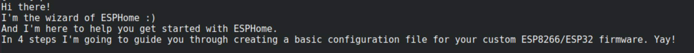

Setting up ESPHome
=========================

.. _esphomeinstallation:

Installing ESPHome Container
----------------------------

Open up your favourite terminal. We'll start by pulling the ESPHome Docker image.

.. code:: bash

   docker pull ghcr.io/esphome/esphome

Connect your ESP32/ESP8266 to your device via USB.

Now let’s setup a configuration file. 
Fortunately, ESPHome has a friendly setup wizard that will guide you through creating your first configuration file. 
For example, if you want to create a configuration file called ``myfirstconfig.yaml``:

.. code:: bash

   docker run \
   --rm \
   -v "${PWD}":/config \
   -it ghcr.io/esphome/esphome \
   wizard \
   myfirstconfig.yaml

.. _esphomeconfiguration:

Configure ESPHome
-----------------

If all goes well you'll be greated by this screen:

Let's go over each step.

1. Choose a name for your ESPHome node, we'll go with *myfirstnode*
   
   .. image:: images/esphome_step1.png
      :alt: Step 1
      
|

2. Pick your microcontroller model, in our case: *ESP32*.

   .. image:: images/esphome_step2.png

|

3. Pick your board, if you're unsure about your boardtype please consult the following page:
   https://docs.platformio.org/en/latest/platforms/espressif32.html#boards, in our case: *featheresp32*.

   .. image:: images/esphome_step3.png

|

4. Configure wireless network access by entering your SSID and password.
   
   .. image:: images/esphome_step4.png

   .. image:: images/esphome_step5.png

|

5. Disable OTA firmware updates by pressing ENTER.

   .. image:: images/esphome_step6.png

|

This wizard should have created a new file in your working directory called ``myfirstconfig.yaml``.

.. _esphomebasicswitch:

Adding a basic switch
---------------------

| To test out our configuration file we can add a simple switch to one of our GPIO pins.
| Open up ``myfirstconfig.yaml`` in your favourite text-editor and the following lines.

.. code:: bash

   switch:
     - platform: gpio
     name: "Light switch 1"
     pin: 5

.. _esphomefirstrun:

Running ESPHome
---------------------

We're now ready to run ESPHome. Simply plug in the device via USB and type the following command.

.. code:: bash

   docker run \
   --rm \
   --privileged \
   -v "${PWD}":/config \
   --device=/dev/ttyUSB0 \
   -it ghcr.io/esphome/esphome \
   run \
   myfirstconfig.yaml

.. autosummary::
   :toctree: generated
