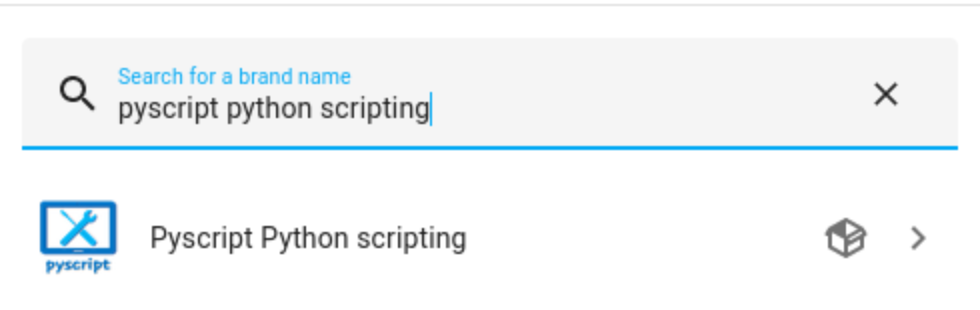
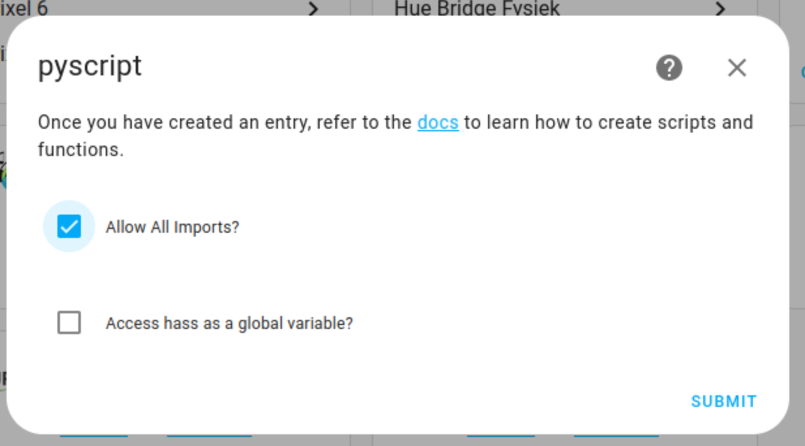

Integrating Pyscript
=========================

.. _pyscriptdownload:

Download Pyscript
-----------------

| Download the latest Pyscript release from `Pyscript Github repository <https://github.com/custom-components/pyscript/releases/>`_.

| Navigate to your home-assistant config directory.

.. code:: bash

   cd /<PATH_TO_YOUR_CONFIG>

| Create a new directory for Pyscript in the custom_components directory.

.. code:: bash

   mkdir -p custom_components/pyscript

| Navigate to the newly created Pyscript directory.

.. code:: bash

   cd custom_components/pyscript

| Move the newly downloaded .zip file to your home-assistant config directory.

.. code:: bash

   cp hass-custom-pyscript.zip /<PATH_TO_YOUR_CONFIG>/custom_components/pyscript

| Unzip the .zip file in the pyscript directory.

.. code:: bash

   cd custom_components/pyscript

.. code:: bash

   unzip hass-custom-pyscript.zip

.. _pyscriptconfig:

Configure Pyscript
------------------

| Open up your Home Assistant instance and navigate to Settings -> Devices & Service -> + Add Integration.
| Search for "Pyscript Python Scripting". Your newly installed integration should show up.

| Check the "Allow All Imports?" checkbox and click on "Submit".

   

